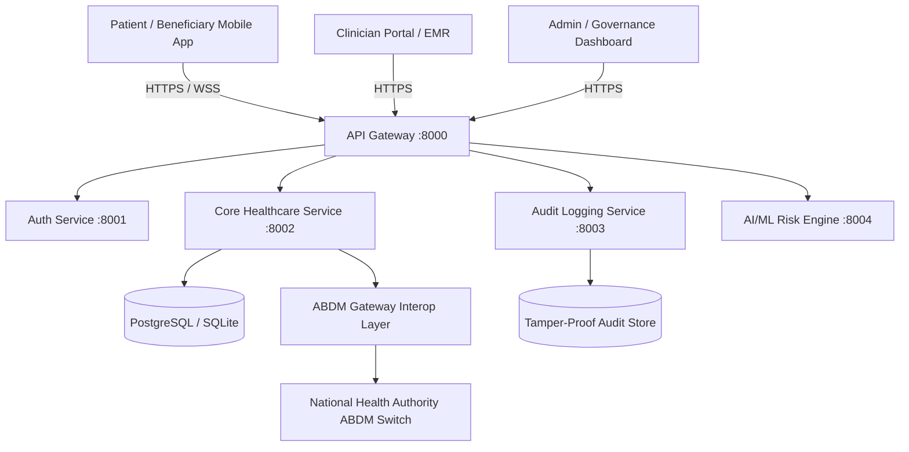

# Ayushman Bharat Architecture & Ecosystem Overview

## Architectural Pillars
- **Zero-Trust & Consent-Driven**: Every patient record query requires a cryptographically validated ABDM consent artifact.
- **Fairness & Explainability by Design**: Machine learning predictive triage models feature automated bias monitoring across demographic vectors.
- **High-Throughput Offline-First**: Built with Service Worker caching and local IndexedDB sync for Tier-2/Tier-3 rural health sub-centres.
