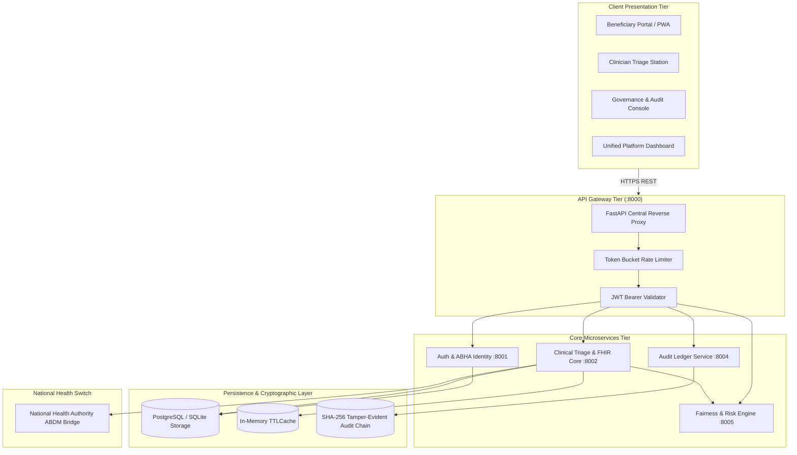

# 🏛️ Ayushman Bharat System Architecture & Technical Specifications

This document details the architectural blueprints, communication protocols, security boundaries, and data flow mechanisms governing the Ayushman Bharat Digital Health Platform.

---

## 1. Top-Level Microservice Topology

---

## 2. Core Service Breakdown & Port Allocations

| Service Name | Default Port | Primary Responsibilities | Dependencies |
| :--- | :--- | :--- | :--- |
| **API Gateway** | `8000` | Traffic routing, rate limiting, request correlation IDs, CORS | All downstreams |
| **Auth Service** | `8001` | ABHA account creation, OTP simulation, JWT issuance, PBKDF2 | Database |
| **Clinical Core** | `8002` | FHIR R4 encounters, appointments, patient directory, vitals | Auth, ML Engine |
| **Audit Service** | `8004` | Hash-chained tamper-evident event logging, ledger verification | Cryptographic utils |
| **AI/ML Engine** | `8005` | Fairlearn bias mitigation, LightGBM risk stratification, SHAP | Scikit-learn, Fairlearn |

---

## 3. Security, Privacy & DPDP Compliance

1. **Deterministic Pseudonymization**:
   - Patient identifiers (ABHA ID, Mobile) are hashed using `HMAC-SHA256` prior to cross-service analytics.
2. **Cryptographic Audit Ledger**:
   - Every read, write, and clinical override operation appends a record with `prev_hash` validation against genesis block `0000...`.
3. **Zero-Trust Token Policy**:
   - Stateless HS256 JWTs with 30-minute expiration windows; role-based access control (`BENEFICIARY`, `CLINICIAN`, `HEALTH_ADMIN`).

---

## 4. Resilience & Offline-First Strategy

- **Service Workers & PWA**: Static shell assets and critical triage decision trees cached locally in client browsers.
- **IndexedDB Sync Engine**: Encounters and vitals queued locally in offline mode with automatic synchronization upon reconnection.
- **TTLCache Layer**: High-frequency symptom-condition lookups cached in-memory with thread-safe locks.
- **Graceful Fallbacks**: Web applications automatically switch to local simulated responses if backends are unreachable.

---

## 5. Health Information Exchange (HIE) & Standards Interoperability

Ayushman Bharat adheres to the **Ayushman Bharat Digital Mission (ABDM)** National Digital Health Blueprint:

1. **FHIR R4 Standardized Resource Models**:
   - `Patient`: Demographics, ABDM identity, consent state, and multi-language preference.
   - `Observation`: LOINC-coded physiological vitals (SpO2, heart rate, blood pressure, temperature).
   - `Condition`: SNOMED CT clinical findings with ICD-10 cross-referencing.
   - `Encounter`: Ambulatory (`AMB`) vs Inpatient (`IMP`) classification with timestamped audit footprints.
   - `Bundle`: Standardized batch collection envelope for interoperable health record transfer.

2. **Clinical Terminology & Coding Standards**:
   - Primary Clinical Findings & Disorders: **SNOMED CT**
   - Laboratory & Vital Observations: **LOINC**
   - Health Identifier: **ABHA 14-Digit Standard**

