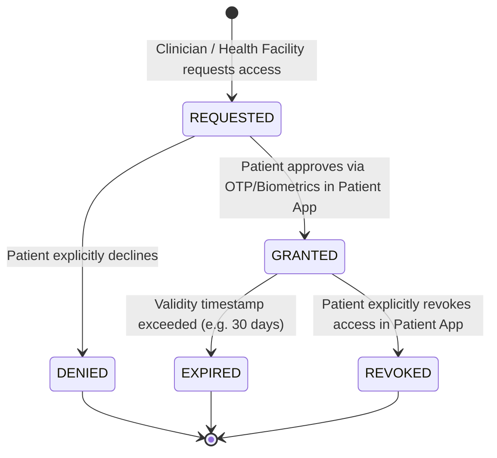

# ABDM Patient Consent Lifecycle Specification

## 1. Overview
Under the Ayushman Bharat Digital Mission (ABDM), patient health records must only be accessed or exchanged when governed by an active, cryptographically signed Consent Artefact.

## 2. Consent State Machine

## 3. Policy Rules & Audit Integration
1. **Zero-Implicit Access**: Access to FHIR resources (`/clinical/patients/{id}/records`) requires an active consent artefact ID.
2. **Immediate Revocation**: Revoking consent generates a high-priority `CONSENT_REVOKED` record in `services/audit-logging/`.
3. **Emergency Override (Break-Glass Protocol)**: In verified `EMERGENCY` triage scenarios, clinicians may trigger a break-glass access. This immediately writes a tamper-evident audit record flagging mandatory administrative review.
